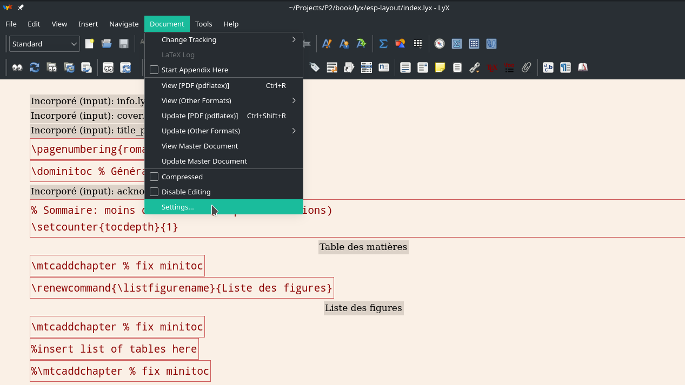

# ESPA Layout Project Report for Lyx &mdash; ANDRIANARISOA Daniel's End of Semester Project Report

This repository can be used as a base for every project report or memoir of the ESP Antsiranana using Lyx. The generated document will follow the school's (ESPA) layout of report/memoir and processed with Latex. This repository Contains also the report of my project of end of semester. Lyx is a good choice instead of writing raw Latex code because of the easiness it brings.

## Requirements

You need to have a latex distribution installed in order to use this lyx template and then obviously you need to install Lyx.
At the time I'm writing this (July 3rd 2021), the current lyx version I'm using is **2.3.6.1**.

## How to use

### Preview the document

The first thing ones would do is to test this repo to get an overview of the resulting document. For that, you should open **index.lyx**(1) at the root folder.

*The repository's root folder*<!-- figure caption -->

Once opened, hit the preview button(2), at the top-left of Lyx's window, in the tool bar. Or just use the keyboard shortcut <kbd>Ctrl + R</kbd>.
From any child document, to preview the whole report you need to click the **preview master document**(3) icon.

*The lyx project index file opened*<!-- figure caption -->

### Generating the document

In the menu bar, go to **File>Export>PDF(pdflatex)**. A new file **index.pdf** will be created in the root folder.

*The generated PDF document*

#### :warning: WARNING
A word of **warning** for you, everything won't work at the firs try. You'll probably need to install several packages before, depending on your operating system.

### Editing the document

The file **index.lyx**(1) is the entry point of our lyx project report. Main configurations of our Lyx document are set here. I don't recommend editing it yet until you have a solid understanding of Lyx and Latex (You will in not much time cause you'll use this software more often anyway).

*Access the document settings*

The main contents are inside the **chapters** files under the **mainmatter** folder. Open and edit them instead.

*The chapters files in the mainmatter folder*

### Modify the book's informations

The file **info.lyx** has for purpose to hold every single information which needs to be displayed within the report:
Author's name, encadreurs, jury members, the school name (Which is ESP Antsiranana), school department, report type, etc.

*Book informations setup and display*

You can play around the definitions by changing their values e.g. the author name to your name since you get this repo for writing your report.

### Adding a new chapter

1- create a new lyx file: the new file's settings should match the index file settings so go to **File>New From Template** and select our index file (it'll serve as template). Save the newly created file (for consistency, I recommend placing all your chapters inside the **mainmatter** folder).

2- In **index.lyx** place the cursor where you want it to be added. Then, in the menu bar go to **Insert>File>child document**. A pop up window will show up browse to the file containing your chapter and set it type to **input**.

### Adding new reference entry

All references are stored inside a single BibTex database file under **backmatter/references.tex** just append your new bibtex reference inside it (use a raw text editor or a bib database manager like [JabRef](https://www.jabref.org/)).

### Notes

* **Lyx guides**: you can find a lot of tutorials and guides on how to use lyx [here](https://wiki.lyx.org/LyX/Tutorials)

* **Backmatter page number**: For now we should update manually the page numbering counter for the backmatter. Ideally, it should resume from the last page's front matter page number.

* **inserting minitoc (chapter toc)**: just below the chapter title, insert a latex code (**Ctrl + L*) `\minitoc`. And don't forget to insert also a clear page after the minitoc.
